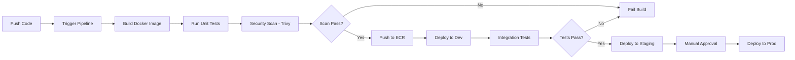

<div align="center">

# 🚀 AWS EKS CI/CD Pipeline

### Production-Grade Kubernetes Deployment on AWS with Automated CI/CD

[](https://aws.amazon.com)
[](https://kubernetes.io)
[](https://terraform.io)
[](https://jenkins.io)
[](https://docker.com)

---


**End-to-end DevOps pipeline for deploying containerized applications to Amazon EKS**

[**📖 Documentation**](#-documentation) • [**🏗️ Architecture**](#-architecture) • [**🚀 Quick Start**](#-quick-start) • [**🔧 Configuration**](#-configuration)

</div>

---

## 🎯 Project Overview

This project demonstrates a **complete DevOps workflow** for deploying microservices to **Amazon Elastic Kubernetes Service (EKS)**. It includes:

| Component | Technology | Purpose |
|-----------|------------|---------|
| **Infrastructure** | Terraform | Provision AWS resources (VPC, EKS, ECR, IAM) |
| **CI/CD** | Jenkins / GitHub Actions | Automated build, test, and deploy |
| **Container Registry** | Amazon ECR | Store Docker images |
| **Orchestration** | Amazon EKS | Kubernetes cluster management |
| **Monitoring** | Prometheus + Grafana | Metrics and visualization |
| **Logging** | CloudWatch + EFK Stack | Centralized logging |
| **Security** | Trivy + SonarQube | Container & code scanning |

---

## 🏗️ Architecture

```
┌─────────────────────────────────────────────────────────────────────────────────────────┐
│                                    AWS Cloud                                             │
├─────────────────────────────────────────────────────────────────────────────────────────┤
│                                                                                          │
│   ┌─────────────────────────────────────────────────────────────────────────────────┐   │
│   │                            VPC (10.0.0.0/16)                                     │   │
│   │                                                                                   │   │
│   │   ┌───────────────────────────────────────────────────────────────────────────┐  │   │
│   │   │                    Availability Zone 1 (us-east-1a)                        │  │   │
│   │   │  ┌─────────────────┐  ┌─────────────────┐  ┌─────────────────────────────┐ │  │   │
│   │   │  │  Public Subnet  │  │ Private Subnet  │  │    Private Subnet (DB)      │ │  │   │
│   │   │  │  (10.0.1.0/24)  │  │ (10.0.10.0/24)  │  │     (10.0.20.0/24)          │ │  │   │
│   │   │  │                 │  │                 │  │                             │ │  │   │
│   │   │  │  ┌───────────┐  │  │  ┌───────────┐  │  │                             │ │  │   │
│   │   │  │  │    NAT    │  │  │  │EKS Worker │  │  │                             │ │  │   │
│   │   │  │  │  Gateway  │  │  │  │   Nodes   │  │  │                             │ │  │   │
│   │   │  │  └───────────┘  │  │  └───────────┘  │  │                             │ │  │   │
│   │   │  └─────────────────┘  └─────────────────┘  └─────────────────────────────┘ │  │   │
│   │   └───────────────────────────────────────────────────────────────────────────┘  │   │
│   │                                                                                   │   │
│   │   ┌───────────────────────────────────────────────────────────────────────────┐  │   │
│   │   │                    Availability Zone 2 (us-east-1b)                        │  │   │
│   │   │  ┌─────────────────┐  ┌─────────────────┐  ┌─────────────────────────────┐ │  │   │
│   │   │  │  Public Subnet  │  │ Private Subnet  │  │    Private Subnet (DB)      │ │  │   │
│   │   │  │  (10.0.2.0/24)  │  │ (10.0.11.0/24)  │  │     (10.0.21.0/24)          │ │  │   │
│   │   │  │                 │  │                 │  │                             │ │  │   │
│   │   │  │  ┌───────────┐  │  │  ┌───────────┐  │  │                             │ │  │   │
│   │   │  │  │    ALB    │  │  │  │EKS Worker │  │  │                             │ │  │   │
│   │   │  │  │ Ingress   │  │  │  │   Nodes   │  │  │                             │ │  │   │
│   │   │  │  └───────────┘  │  │  └───────────┘  │  │                             │ │  │   │
│   │   │  └─────────────────┘  └─────────────────┘  └─────────────────────────────┘ │  │   │
│   │   └───────────────────────────────────────────────────────────────────────────┘  │   │
│   │                                                                                   │   │
│   └─────────────────────────────────────────────────────────────────────────────────┘   │
│                                                                                          │
│   ┌──────────────┐  ┌──────────────┐  ┌──────────────┐  ┌────────────────────────────┐  │
│   │   Amazon     │  │    Amazon    │  │   AWS IAM    │  │       CloudWatch           │  │
│   │     ECR      │  │    EKS       │  │    Roles     │  │    Logs & Metrics          │  │
│   └──────────────┘  └──────────────┘  └──────────────┘  └────────────────────────────┘  │
│                                                                                          │
└─────────────────────────────────────────────────────────────────────────────────────────┘

                                         │
                                         │ CI/CD Pipeline
                                         ▼

┌─────────────────────────────────────────────────────────────────────────────────────────┐
│                              CI/CD Pipeline Flow                                         │
├─────────────────────────────────────────────────────────────────────────────────────────┤
│                                                                                          │
│   ┌─────────┐    ┌─────────┐    ┌─────────┐    ┌─────────┐    ┌─────────┐    ┌───────┐  │
│   │  Code   │───▶│  Build  │───▶│  Test   │───▶│  Scan   │───▶│  Push   │───▶│Deploy │  │
│   │  Push   │    │  App    │    │  Unit   │    │ Security│    │  ECR    │    │ EKS   │  │
│   │ GitHub  │    │ Docker  │    │  Tests  │    │ Trivy   │    │ Image   │    │       │  │
│   └─────────┘    └─────────┘    └─────────┘    └─────────┘    └─────────┘    └───────┘  │
│                                                                                          │
└─────────────────────────────────────────────────────────────────────────────────────────┘
```

---

## ✨ Features

### 🔧 Infrastructure as Code
- **Modular Terraform** configurations for reusability
- **Multi-environment** support (dev, staging, prod)
- **State management** with S3 backend and DynamoDB locking

### 🚢 Kubernetes Deployment
- **Helm charts** for application deployment
- **Horizontal Pod Autoscaling (HPA)** for scalability
- **Ingress Controller** with AWS ALB
- **Secrets management** with AWS Secrets Manager

### 🔄 CI/CD Pipeline
- **Automated builds** on every commit
- **Multi-stage Docker builds** for optimized images
- **Blue/Green deployments** for zero downtime
- **Rollback capabilities** for quick recovery

### 🔒 Security
- **Private EKS cluster** with no public endpoint
- **Network policies** for pod-to-pod security
- **IAM Roles for Service Accounts (IRSA)**
- **Container image scanning** with Trivy

---

## 📁 Project Structure

```
aws-eks-cicd-pipeline/
├── 📂 terraform/
│   ├── 📂 modules/
│   │   ├── 📂 vpc/              # VPC, Subnets, NAT Gateway
│   │   ├── 📂 eks/              # EKS Cluster & Node Groups
│   │   ├── 📂 ecr/              # Container Registry
│   │   ├── 📂 iam/              # IAM Roles & Policies
│   │   └── 📂 monitoring/       # CloudWatch, Prometheus
│   ├── 📂 environments/
│   │   ├── 📂 dev/
│   │   ├── 📂 staging/
│   │   └── 📂 prod/
│   ├── 📄 main.tf
│   ├── 📄 variables.tf
│   ├── 📄 outputs.tf
│   └── 📄 backend.tf
│
├── 📂 kubernetes/
│   ├── 📂 base/                 # Base Kubernetes manifests
│   │   ├── 📄 deployment.yaml
│   │   ├── 📄 service.yaml
│   │   ├── 📄 ingress.yaml
│   │   └── 📄 hpa.yaml
│   ├── 📂 overlays/             # Kustomize overlays
│   │   ├── 📂 dev/
│   │   ├── 📂 staging/
│   │   └── 📂 prod/
│   └── 📂 helm/                 # Helm charts
│       └── 📂 app-chart/
│
├── 📂 jenkins/
│   ├── 📄 Jenkinsfile           # Main pipeline definition
│   ├── 📄 Jenkinsfile.deploy    # Deployment pipeline
│   └── 📂 scripts/
│       ├── 📄 build.sh
│       ├── 📄 test.sh
│       └── 📄 deploy.sh
│
├── 📂 .github/
│   └── 📂 workflows/
│       ├── 📄 ci.yaml           # GitHub Actions CI
│       └── 📄 cd.yaml           # GitHub Actions CD
│
├── 📂 app/                      # Sample application
│   ├── 📄 Dockerfile
│   ├── 📄 app.py
│   └── 📄 requirements.txt
│
├── 📂 monitoring/
│   ├── 📂 prometheus/
│   ├── 📂 grafana/
│   │   └── 📂 dashboards/
│   └── 📂 alertmanager/
│
├── 📂 docs/
│   ├── 📄 SETUP.md
│   ├── 📄 ARCHITECTURE.md
│   └── 📄 TROUBLESHOOTING.md
│
├── 📄 Makefile                  # Automation commands
├── 📄 .env.example
└── 📄 README.md
```

---

## 🚀 Quick Start

### Prerequisites

| Tool | Version | Installation |
|------|---------|--------------|
| AWS CLI | >= 2.0 | [Install Guide](https://aws.amazon.com/cli/) |
| Terraform | >= 1.5.0 | [Install Guide](https://terraform.io/downloads) |
| kubectl | >= 1.28.0 | [Install Guide](https://kubernetes.io/docs/tasks/tools/) |
| Docker | >= 24.0 | [Install Guide](https://docs.docker.com/get-docker/) |
| Helm | >= 3.12 | [Install Guide](https://helm.sh/docs/intro/install/) |

### Step 1: Configure AWS

```bash
# Configure AWS CLI
aws configure
# Enter your AWS Access Key, Secret Key, Region (us-east-1)

# Verify access
aws sts get-caller-identity
```

### Step 2: Create S3 Backend (One-time Setup)

```bash
# Create S3 bucket for Terraform state
aws s3 mb s3://your-terraform-state-bucket --region us-east-1

# Create DynamoDB table for state locking
aws dynamodb create-table \
    --table-name terraform-state-lock \
    --attribute-definitions AttributeName=LockID,AttributeType=S \
    --key-schema AttributeName=LockID,KeyType=HASH \
    --billing-mode PAY_PER_REQUEST
```

### Step 3: Deploy Infrastructure

```bash
# Clone the repository
git clone https://github.com/PrashantMurtale/aws-eks-cicd-pipeline.git
cd aws-eks-cicd-pipeline/terraform/environments/dev

# Initialize Terraform
terraform init

# Review the plan
terraform plan -out=tfplan

# Apply infrastructure
terraform apply tfplan
```

### Step 4: Configure kubectl

```bash
# Update kubeconfig
aws eks update-kubeconfig --name eks-cluster-dev --region us-east-1

# Verify connection
kubectl get nodes
kubectl get pods -A
```

### Step 5: Deploy Application

```bash
# Using Helm
helm install myapp ./kubernetes/helm/app-chart \
    --namespace default \
    --set image.repository=$(terraform output -raw ecr_repository_url) \
    --set image.tag=latest

# Or using kubectl
kubectl apply -k ./kubernetes/overlays/dev/
```

---

## 🔧 Configuration

### Terraform Variables

```hcl
# terraform/environments/dev/terraform.tfvars

# AWS Configuration
aws_region     = "us-east-1"
environment    = "dev"
project_name   = "myapp"

# VPC Configuration
vpc_cidr             = "10.0.0.0/16"
availability_zones   = ["us-east-1a", "us-east-1b"]

# EKS Configuration
eks_cluster_version  = "1.28"
eks_node_instance_types = ["t3.medium"]
eks_desired_capacity = 2
eks_min_capacity     = 1
eks_max_capacity     = 5

# Tags
tags = {
  Project     = "aws-eks-cicd"
  Environment = "dev"
  ManagedBy   = "terraform"
}
```

### Jenkins Pipeline Configuration

```groovy
// jenkins/Jenkinsfile

pipeline {
    agent any
    
    environment {
        AWS_REGION = 'us-east-1'
        ECR_REGISTRY = '123456789.dkr.ecr.us-east-1.amazonaws.com'
        IMAGE_NAME = 'myapp'
        EKS_CLUSTER = 'eks-cluster-dev'
    }
    
    stages {
        stage('Checkout') {
            steps {
                git branch: 'main', url: 'https://github.com/PrashantMurtale/aws-eks-cicd-pipeline.git'
            }
        }
        
        stage('Build') {
            steps {
                sh 'docker build -t ${IMAGE_NAME}:${BUILD_NUMBER} .'
            }
        }
        
        stage('Security Scan') {
            steps {
                sh 'trivy image ${IMAGE_NAME}:${BUILD_NUMBER}'
            }
        }
        
        stage('Push to ECR') {
            steps {
                sh '''
                    aws ecr get-login-password --region ${AWS_REGION} | docker login --username AWS --password-stdin ${ECR_REGISTRY}
                    docker tag ${IMAGE_NAME}:${BUILD_NUMBER} ${ECR_REGISTRY}/${IMAGE_NAME}:${BUILD_NUMBER}
                    docker push ${ECR_REGISTRY}/${IMAGE_NAME}:${BUILD_NUMBER}
                '''
            }
        }
        
        stage('Deploy to EKS') {
            steps {
                sh '''
                    aws eks update-kubeconfig --name ${EKS_CLUSTER} --region ${AWS_REGION}
                    kubectl set image deployment/myapp myapp=${ECR_REGISTRY}/${IMAGE_NAME}:${BUILD_NUMBER}
                    kubectl rollout status deployment/myapp
                '''
            }
        }
    }
}
```

---

## 📊 Monitoring & Observability

### Pre-configured Dashboards

| Dashboard | Purpose |
|-----------|---------|
| 🖥️ **Cluster Overview** | Node health, resource utilization |
| 📦 **Pod Metrics** | CPU, Memory, Network per pod |
| 🔄 **Deployment Status** | Rollout progress, replica status |
| 🌐 **Ingress Metrics** | Request rate, latency, errors |
| 📈 **Application Metrics** | Custom app-level metrics |

### Alerting Rules

```yaml
# Pre-configured alerts
- High CPU Usage (> 80%)
- High Memory Usage (> 85%)
- Pod CrashLoopBackOff
- High Error Rate (> 5%)
- Deployment Failed
- Node Not Ready
```

---

## 💰 Cost Estimation (Dev Environment)

| Resource | Type | Estimated Monthly Cost |
|----------|------|------------------------|
| EKS Cluster | Control Plane | ~$73 |
| EC2 (2x t3.medium) | Worker Nodes | ~$60 |
| NAT Gateway | 2 AZs | ~$65 |
| ALB | Application LB | ~$20 |
| ECR | Container Registry | ~$5 |
| CloudWatch | Logs & Metrics | ~$15 |
| **Total** | | **~$238/month** |

> 💡 **Cost Optimization Tips:**
> - Use Spot Instances for non-prod environments (save up to 90%)
> - Schedule cluster shutdown during non-business hours
> - Use single NAT Gateway for dev/staging

---

## 🔒 Security Best Practices Implemented

| Feature | Description |
|---------|-------------|
| ✅ **Private Subnets** | Worker nodes in private subnets |
| ✅ **IRSA** | IAM Roles for Service Accounts |
| ✅ **Network Policies** | Pod-to-pod traffic control |
| ✅ **Secrets Encryption** | KMS encryption for K8s secrets |
| ✅ **Image Scanning** | Trivy scans on every build |
| ✅ **RBAC** | Role-based access control |
| ✅ **Pod Security Standards** | Restricted pod security admission |
| ✅ **Audit Logging** | CloudWatch audit logs enabled |

---

## 🛠️ Useful Commands

```bash
# Makefile shortcuts
make init          # Initialize Terraform
make plan          # Create execution plan
make apply         # Apply infrastructure
make destroy       # Destroy infrastructure

make build         # Build Docker image
make push          # Push to ECR
make deploy        # Deploy to EKS

make logs          # View application logs
make shell         # Shell into running pod
make port-forward  # Forward local port to service
```

---

## 🔄 CI/CD Workflow



---

## 🧹 Cleanup

```bash
# Delete application
helm uninstall myapp
# OR
kubectl delete -k ./kubernetes/overlays/dev/

# Destroy infrastructure
cd terraform/environments/dev
terraform destroy

# Clean up S3 and DynamoDB (only if no longer needed)
aws s3 rb s3://your-terraform-state-bucket --force
aws dynamodb delete-table --table-name terraform-state-lock
```

---

## 📚 Documentation

| Document | Description |
|----------|-------------|
| [SETUP.md](docs/SETUP.md) | Detailed setup instructions |
| [ARCHITECTURE.md](docs/ARCHITECTURE.md) | Architecture deep-dive |
| [TROUBLESHOOTING.md](docs/TROUBLESHOOTING.md) | Common issues and solutions |

---

## 🤝 Contributing

Contributions are welcome! Please follow these steps:

1. Fork the repository
2. Create a feature branch (`git checkout -b feature/amazing-feature`)
3. Commit changes (`git commit -m 'Add amazing feature'`)
4. Push to branch (`git push origin feature/amazing-feature`)
5. Open a Pull Request

---

## 📄 License

This project is licensed under the MIT License - see the [LICENSE](LICENSE) file for details.

---

<div align="center">

### 🌟 If this project helped you, please give it a star!

**Built with ❤️ by [Prashant Murtale](https://github.com/PrashantMurtale)**

[](https://linkedin.com/in/YOUR_LINKEDIN)

**[🔝 Back to Top](#-aws-eks-cicd-pipeline)**

</div>
